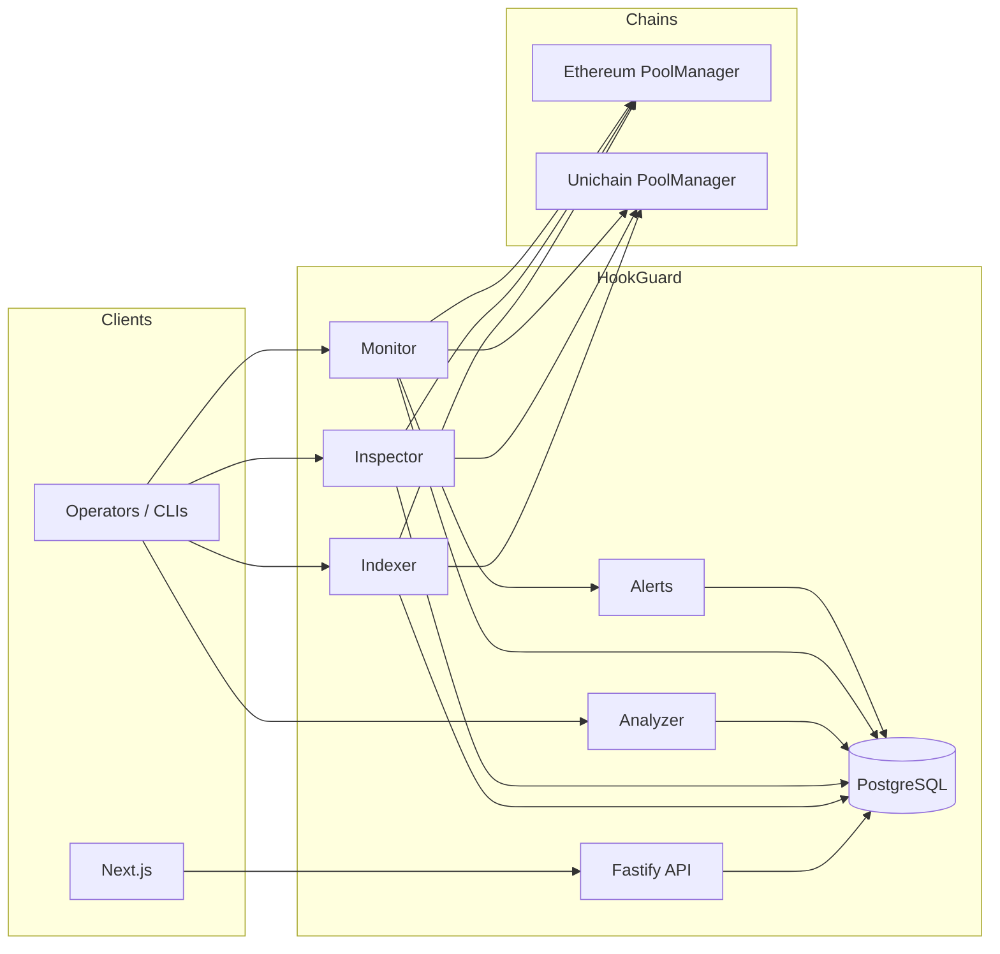
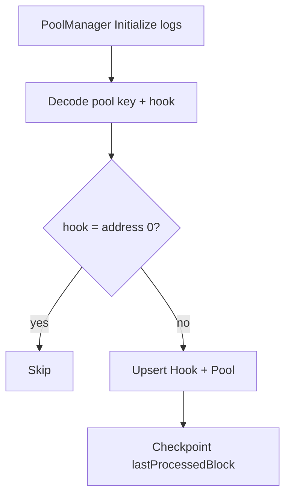
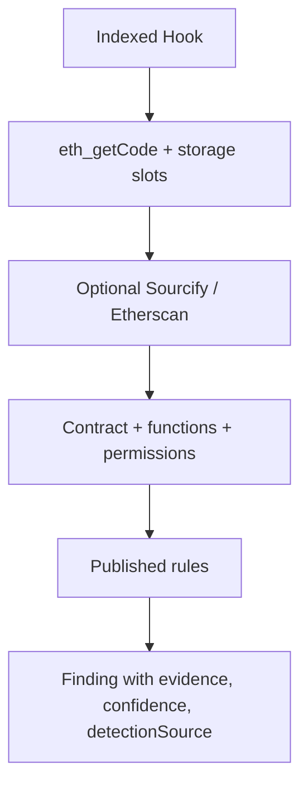
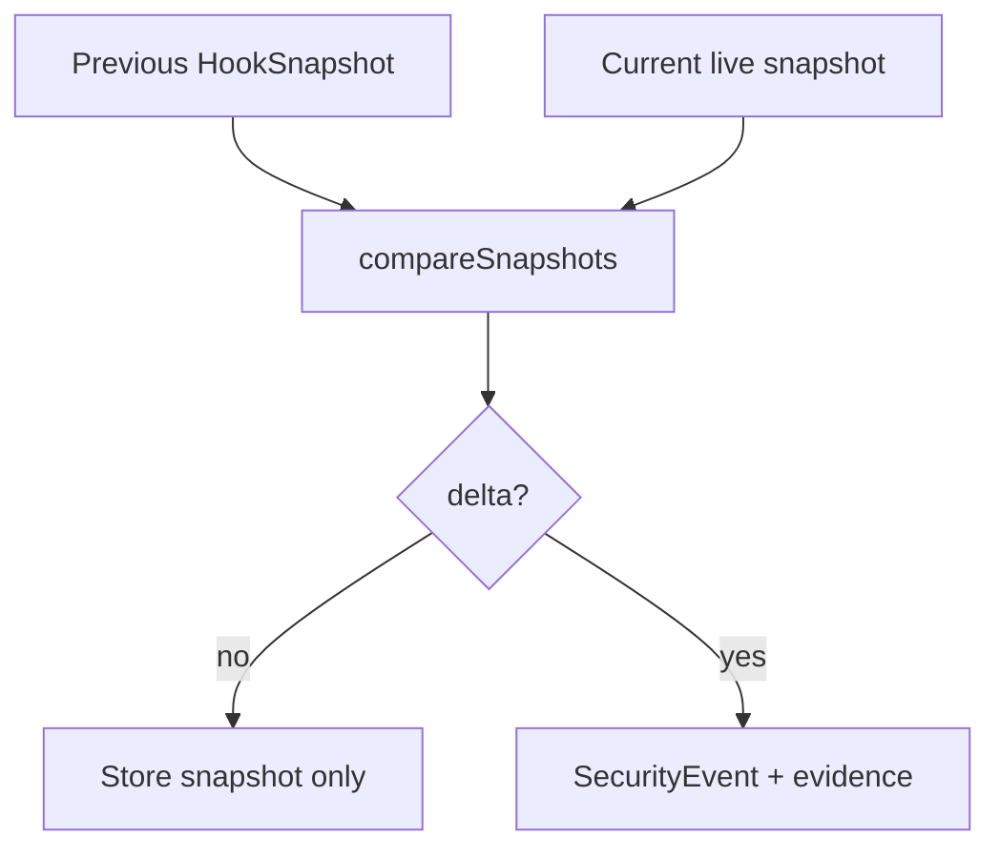
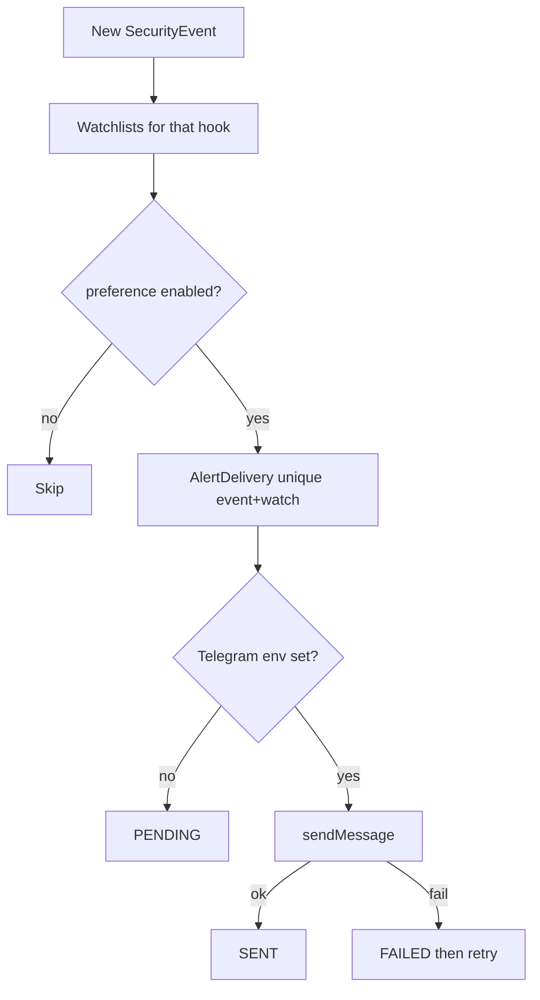

# Architecture

HookGuard is a TypeScript monorepo: a Fastify API, a Next.js UI, and a blockchain package that talks to Uniswap v4 **read-only**.

HookGuard does not replace a professional smart-contract audit. It does not fill `Hook.riskScore`.

## System

All chain arrows are `eth_getLogs`, `eth_call`, `eth_getCode`, and `eth_getStorageAt`.

## Monorepo

| Path | Responsibility |
| --- | --- |
| `apps/api` | HTTP, Prisma, CLIs (`index:v4`, `inspect:contracts`, `analyze:hooks`, `monitor:hooks`, `alerts:retry`) |
| `apps/web` | Landing, dashboard, explorer, public hook pages, watchlist, methodology |
| `packages/types` | Domain types (hooks, findings, events, alerts) |
| `packages/config` | Environment loading. No secrets in git. |
| `packages/blockchain` | Chain registry, log fetch, contract intelligence, analysis rules, snapshot comparison |
| `docs` | Product, methodology, validation, grant, deployment |
| `data/validation` | Ground-truth review fixture |

`apps/*` are deployable. Chain knowledge lives only in `packages/blockchain`.

## Indexing pipeline

- CLI: `npm run index:v4 -- --chain=ethereum`
- Source: Uniswap v4 `Initialize` topic on the canonical PoolManager
- Resume: `indexer_checkpoints`
- Oversized RPC ranges are split; a single crashing block can be skipped so the backfill continues

## Analysis pipeline

- Inspect: `npm run inspect:contracts`
- Analyze: `npm run analyze:hooks`
- Findings always include evidence JSON. Re-analyze preserves validation reviews.
- Confidence (`HIGH` / `MEDIUM` / `LOW`) is not severity.

## Monitoring pipeline

- CLI: `npm run monitor:hooks`
- Snapshot fields: implementation, admin, owner, bytecode hash, functions hash, permissions hash, block number
- First snapshot is a baseline (no events)
- Duplicate unresolved fingerprints are not inserted

## Alert pipeline

- Identifier-based watches (no accounts)
- Telegram via `TELEGRAM_BOT_TOKEN` + `TELEGRAM_CHAT_ID`
- `npm run alerts:retry` for `PENDING` / `FAILED` with `attempts < 5`

## HTTP surface (selected)

| Method | Path |
| --- | --- |
| GET | `/health` |
| GET | `/corpus` |
| GET | `/hooks`, `/hooks/:address` |
| GET | `/hooks/:address/contract` |
| GET | `/hooks/:address/findings` |
| GET | `/hooks/:address/events` |
| GET | `/hooks/:address/monitoring` |
| GET | `/public/hooks/:address` |
| POST/DELETE/GET | `/hooks/:address/watch` |
| GET | `/events/recent`, `/alerts/recent`, `/watchlist` |

No `riskScore` on public JSON.

## Database

PostgreSQL. Prisma schema: `apps/api/prisma/schema.prisma`.

Core models: `Hook`, `Pool`, `Contract`, `Finding`, `HookSnapshot`, `SecurityEvent`, `Watchlist`, `AlertPreference`, `AlertDelivery`, `IndexerCheckpoint`.

`Hook.riskScore` remains nullable and unused.

## Frontend

| Route | Page |
| --- | --- |
| `/` | Landing |
| `/dashboard` | Corpus + recent events/alerts |
| `/hooks` | Explorer |
| `/hooks/[address]` | In-app security page |
| `/public/hooks/[address]` | Shareable public page |
| `/watchlist` | Client identifier watches |
| `/methodology` | Fact vs finding, live counts |

## Chains

| Chain | ID | PoolManager | Default start block |
| --- | --- | --- | --- |
| Ethereum | 1 | `0x000000000004444c5dc75cB358380D2e3dE08A90` | 21689047 |
| Unichain | 130 | `0x1f98400000000000000000000000000000000004` | 1 (indexer may override) |

RPC from `RPC_URL_ETHEREUM` / `RPC_URL_UNICHAIN`.

## Configuration and ops

See [DEPLOYMENT.md](./DEPLOYMENT.md). Local Postgres is `docker compose` on host port **5434**.
