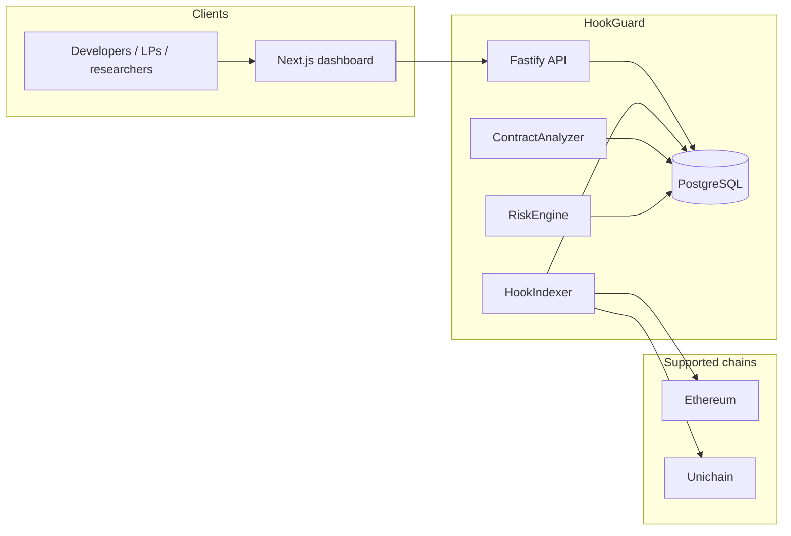

# Architecture

HookGuard is a TypeScript monorepo. Phase 0 establishes module boundaries so later phases can add indexing and analysis without rewriting the product.

## Vision

Help Uniswap v4 developers, LPs, researchers, and protocols understand **hook** risk.

Three product surfaces:

1. **Hook Registry** — what hooks exist, where they are deployed, which pools use them.
2. **Security Analysis Engine** — v4-specific, deterministic inspection of hook contracts.
3. **Risk Dashboard** — scores and findings presented without invented data.

## System context



Phase 0 ships `Web`, `API`, `DB` schema, and the **interfaces** for Indexer / Analyzer / Risk. Implementations are later phases.

## Monorepo

| Path | Responsibility |
| --- | --- |
| `apps/api` | HTTP API, Prisma schema, health endpoint |
| `apps/web` | Landing, dashboard, explorer, hook detail |
| `packages/types` | Domain types shared by API and web |
| `packages/config` | Environment-based configuration. No secrets in git. |
| `packages/blockchain` | Chain registry; `HookIndexer`, `ContractAnalyzer`, `RiskEngine` interfaces |
| `docs` | Product and security documentation |
| `tests` | Cross-package checks (schema, frontend foundation) |

**Why this split**

- `apps/*` are deployable. `packages/*` are libraries.
- Chain knowledge lives in `packages/blockchain`, not in the API or UI, so both can stay chain-agnostic.
- Config is a package so API and web validate env the same way.
- UI primitives stay in `apps/web`. Extracting them to `packages/ui` would add a build graph for components that only Next.js uses.

## Backend

Fastify app (`apps/api`):

- `GET /health` — liveness plus the configured chain list.
- Config via `loadApiConfigFromEnv()` (`@hookguard/config`).
- Prisma client is wired (`src/lib/prisma.ts`) but unused by health. No indexer connection in Phase 0.

Process entry: `src/index.ts`. Tests use `buildApp()` and Fastify `inject`, so the health test does not bind a port.

## Database

PostgreSQL. Prisma schema in `apps/api/prisma/schema.prisma`.

| Model | Role |
| --- | --- |
| `Hook` | One row per `(address, chainId)` |
| `Pool` | Uniswap v4 pool that references a hook |
| `Contract` | Bytecode / optional verified source |
| `Finding` | Structured observation attached to a hook |

Relations:

- `Finding.hookId → Hook.id` (cascade delete)
- `Pool.(hookAddress, chainId) → Hook.(address, chainId)`

`riskScore` is nullable. Unscored hooks must not display a fabricated number.

## Frontend

Next.js App Router, Tailwind, shadcn-style primitives, wagmi + RainbowKit.

| Route | Page |
| --- | --- |
| `/` | Landing |
| `/dashboard` | Registry snapshot (empty state) |
| `/hooks` | Explorer table (empty state) |
| `/hooks/[address]` | Detail placeholder |

Data access is `src/lib/registry.ts`. It returns empty collections on purpose.

## Blockchain module

`packages/blockchain` is the only place that knows Uniswap v4 deployment addresses.

Phase 0 chains:

| Chain | ID | PoolManager |
| --- | --- | --- |
| Ethereum | 1 | `0x000000000004444c5dc75cB358380D2e3dE08A90` |
| Unichain | 130 | `0x1f98400000000000000000000000000000000004` |

RPC URLs come from `RPC_URL_ETHEREUM` and `RPC_URL_UNICHAIN`. Public defaults exist for local development; production must supply its own endpoints.

Interfaces (not implemented):

```ts
interface HookIndexer { start(); stop(); getHook(); getIndexedHookCount(); }
interface ContractAnalyzer { analyze(request); }
interface RiskEngine { score(request); }
```

## Configuration

- Root `.env.example`, `apps/api/.env.example`, `apps/web/.env.example`
- Required in production API: `DATABASE_URL`
- Optional: RPC URLs, `NEXT_PUBLIC_WALLETCONNECT_PROJECT_ID`
- `.env` is gitignored

Local Postgres: `docker compose up -d`.

## Testing and build

```
npm run test    # Vitest
npm run build   # packages → API → Next.js
```

Health is tested with Fastify inject. Schema tests parse Prisma and run `prisma validate`. Frontend tests assert pages, components, and empty states. `npm run build` is the real Next.js production compile.
