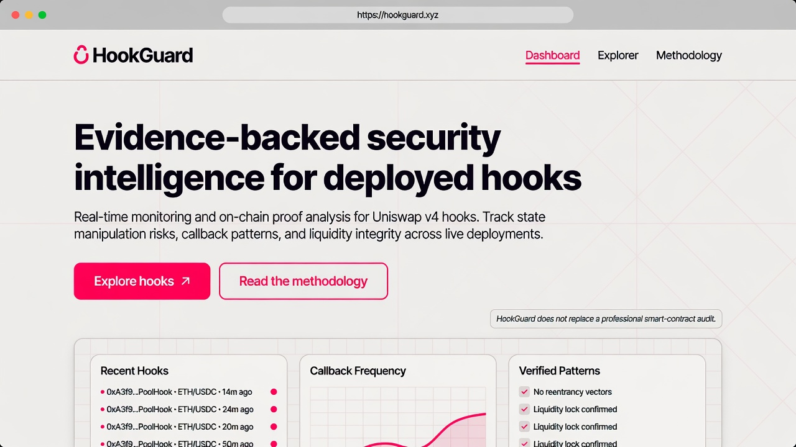
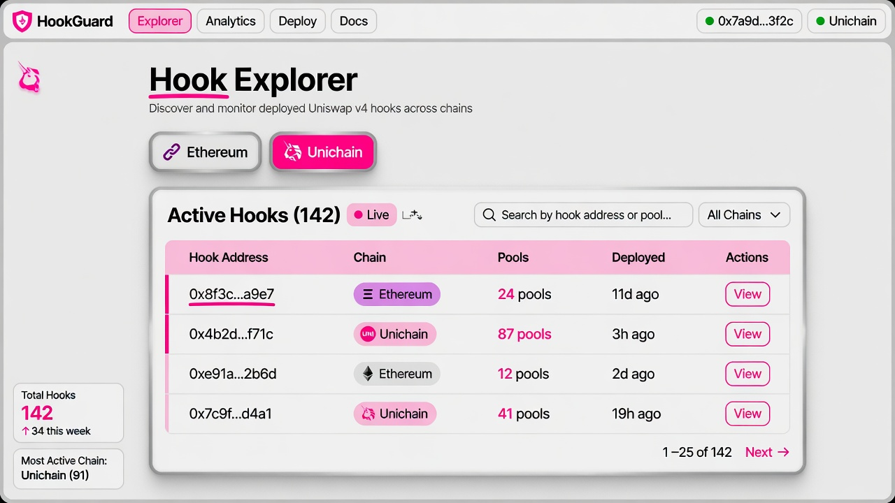
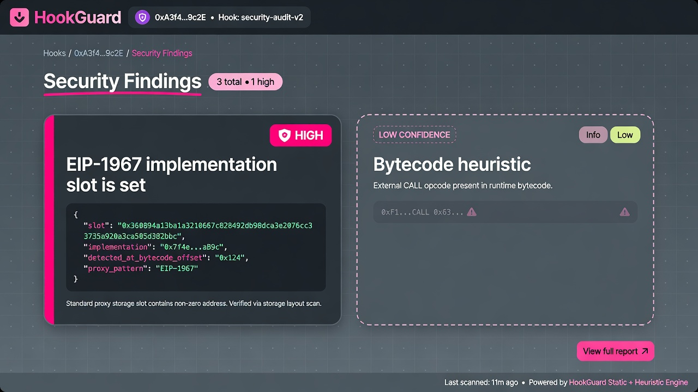
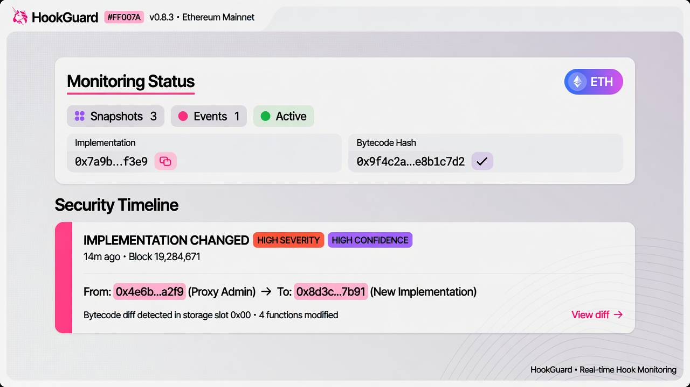

# Demo walkthrough

Run HookGuard locally (`docs/DEPLOYMENT.md`). This is a **product tour**, not a hosted SaaS demo. Screenshots in [`docs/screenshots/`](./screenshots/) are UI illustrations of that local app.

HookGuard does not replace a professional smart-contract audit. It does not show a numerical risk score.

## Prerequisites

```bash
docker compose up -d
npm run db:migrate:deploy -w @hookguard/api
npm run dev:api    # http://localhost:3001/health and /ready
npm run dev:web    # http://localhost:3000
```

Optional, if the database is empty:

```bash
npm run index:v4 -- --chain=ethereum --max-blocks=2000
npm run inspect:contracts -- --chain=ethereum
npm run analyze:hooks -- --chain=ethereum
```

## Homepage walkthrough

Open `/`.



1. **Hero** — evidence-backed intelligence for deployed v4 hooks, not a score.
2. **Problem** — hooks run in the swap path; a pool listing is not due diligence.
3. **How HookGuard Works** — discover → inspect → findings → watch.
4. **Coverage Metrics** — live `/corpus` counts if the API is populated, otherwise the published Phase 2C snapshot (880 hooks / 2,805 pools). Those are indexer outputs, not users.
5. **Methodology** — fact vs finding, severity vs confidence, rule tiers.
6. **Roadmap** — shipped vs next; scoring is not on the roadmap for launch.
7. **CTA** — explorer and dashboard.

Confirm the footer disclaimer: HookGuard does not replace an audit.

## Hook exploration

Open `/hooks`.



1. Filter Ethereum (`chainId=1`) or Unichain (`chainId=130`).
2. Open a row. Addresses are truncated in the table; the detail page shows the full checksummed address.
3. On `/hooks/:address` you should see chain badge, pool list, and a **Public page** link to `/public/hooks/:address` (shareable layout, no sidebar).
4. **Watch hook** stores a browser identifier (no accounts). `/watchlist` lists those watches.

Empty state copy is “No hooks indexed yet” until `index:v4` has run.

## Findings walkthrough

On a hook that has been inspected and analyzed:



1. **Security Findings** — each card has severity, confidence, title, description, detection source, evidence.
2. **HIGH confidence** cards are solid (slots, flags, successful `owner()`).
3. **LOW CONFIDENCE** / dashed cards are bytecode heuristics. A CALL opcode is *not* “external call in the swap path.”
4. There is **no** 0–100 score on this page.

Public page `/public/hooks/:address` shows the same findings plus contract intelligence.

## Monitoring walkthrough

After `npm run monitor:hooks`:



1. **Monitoring Status** — snapshot count, last run, implementation / admin / owner, bytecode hash.
2. First run is a **baseline** (no events).
3. A later run that sees an EIP-1967 implementation change emits `IMPLEMENTATION_CHANGED` on the **Security Timeline**.
4. If the hook is watched and Telegram env is unset, `GET /hooks/:address/alerts` shows `PENDING` deliveries — that is expected.

Dashboard `/dashboard` lists recent changes and recent alerts from the same data.

## Health during a demo

```bash
curl -s http://localhost:3001/health | jq .status   # ok
curl -s http://localhost:3001/ready | jq .database  # up
```
